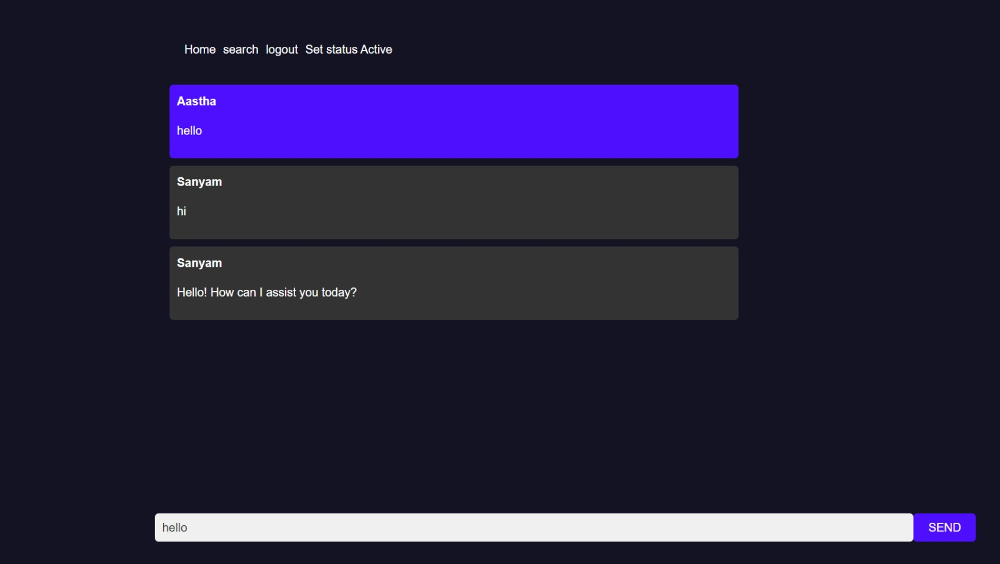

# Backend for a Real-Time Chat Application

Setup and run instructions

1. Install Git:

Make sure you have Git installed on your system. You can download it from the official website at https://git-scm.com/downloads.

2. Clone the Project:

Open your terminal and navigate to your desired project directory.
Use the git clone command followed by the project repository URL (provided separately) to clone the project codebase.

git clone <project_repository_URL>

 
Folder 
 

 

3. Install Dependencies:

Navigate to the cloned project directory using cd Chat.

for Backend 
cd Backend
Run npm install to install all the required dependencies listed in the project's package.json file. This will download the necessary libraries and tools for the application to function.

for Frontend 
cd Chat
Run npm install to install all the required dependencies listed in the project's package.json file. This will download the necessary libraries and tools for the application to function.

4. Configuration:

This project might require some environment variables for database connection or API keys. Refer to the project documentation (potentially a .env file or instructions within the code) for specific configuration steps.

5. Running the Application:

Once the dependencies are installed and configurations are complete (if any), refer to the project documentation for specific instructions on starting the server. This might involve running a script like npm run dev for Chat  and node start from Backend

# database

# API

# /register API 

http://localhost:2000/register

1. Sending Information:

Users will send their name, email address, and password in the request body.

2. Checking Information:

The API verifies if all three fields (name, email, password) are provided. If any are missing, it sends an error message back.
Email Check:

The API checks if the provided email address is already registered. If it exists, it sends an error message to prevent duplicate accounts.

3. Creating User:

If everything is valid, the API creates a new user document in the database with the provided name, email, and password 
Sending Response:

The API sends a response back to the user indicating success or failure.
On success: It includes a message and the newly created user information.
On failure: It includes an error message explaining the issue.

# /login API

http://localhost:2000/register

1. Sending Credentials:

Users will send their email address and password in the request body.

2. Finding User:

The API searches the database for a user document matching the provided email address and password 

3. Sending Response:

The API sends a response back to the user indicating success or failure.
On success: It includes a message and the user information .
On failure: It includes a generic message like "not exist" to avoid revealing specific details about why the login failed (e.g., incorrect email or password).

# /search API

http://localhost:2000/search

1. Searching Users:

Users send a request containing the email address of the person they want to find in the request body.

2. Finding User:

The API searches the database for a user document matching the provided email address.

3. Sending Response:

The API sends a response back to the user indicating success or failure.

# /conversation API

http://localhost:2000/conversation

1. Creating a Conversation:

Users send a request containing two pieces of information in the request body:
person1: The email address or user ID of the first person involved in the conversation.
person2: The email address or user ID of the second person involved in the conversation.

2. Saving Conversation Data:

The API creates a new "Conversation" document in the database. This document likely stores information about the conversation, such as:
Participants (person1 and person2)
Unique conversation ID 

3. Sending Response:

The API sends a response back to the user indicating success or failure.
On success: It includes a message and the newly created conversation object.
On failure: It includes a generic message like "not exist" to avoid revealing specific reasons for failure (e.g., invalid user IDs).

# /getPerson API

http://localhost:2000/getPerson

1. Requesting Conversation Info:

Users send a request containing the conversation ID  in the request body.

2. Fetching Conversation Data:

The API uses the provided ID to search the database for the corresponding conversation document.
The /getPerson API endpoint retrieves the details of a conversation, including information about both participants.

3. Sending Response:

The API sends a response back to the user indicating success or failure.

On success: It includes a message and the conversation object, which now includes detailed information about both participants  instead of just their IDs.

On failure: It includes a message indicating "Conversation not found" to avoid revealing specifics about why the request failed (e.g., invalid conversation ID).

# /getChat API

http://localhost:2000/getChat

The API searches the database for messages belonging to the conversation specified by the ID.

# /getPerson API

http://localhost:2000/changeStatus

The API finds the user document matching the provided ID and updates the "isActive" field to reflect the new online status.

# Real time Chat Socket.io
1. User Connects: When a user joins the chat, a message is logged indicating their connection.

2. Sending Messages: Users send messages through the"send_message" event. 
The data object typically includes:

message: The actual text content of the user's message.
sender: Information about the user who sent the message

roomid: The unique identifier for the conversation the message belongs to.

nextSender (optional): A flag indicating if an AI response is expected (explained later).

3. AI Assistant (when nextSender is true):

Triggering AI: If the nextSender flag is present, the code triggers an AI model to generate a response based on the user's message .

Saving and Broadcasting AI Response: The AI-generated text is then saved as a new message with a different sender  and the same conversation ID. Finally, this AI-generated message is also broadcast to all connected users using the "receive_message" event.

# Design

